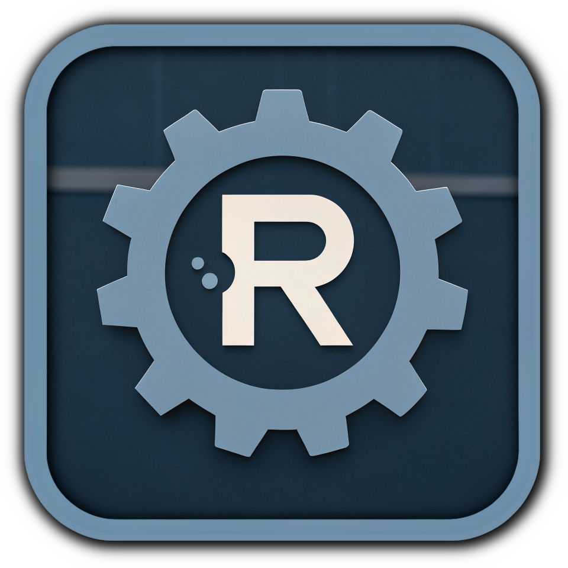

<p align="center">
  
</p>

<h1 align="center">Rust LDD Minimal - Minimalist Recursive ELF Dependency Resolver</h1> 
<h3 align="center">A high-performance, pure-rust dependency analyzer designed to safely and recursively map dynamic library trees on POSIX systems.</h3>

<p align="center">
    
    
    
    
</p>

## 🔍 Overview

`rldd_minimal` is a **minimal Rust library** designed to recursively inspect ELF binaries
and their shared library dependencies. It was specifically created for integration with
the [Rex - Static Rust Executable](https://github.com/LinuxDicasPro/Rex), prioritizing
**portability, robustness, and security** over feature complexity.
This library is intentionally minimal; most features are focused on safe,
reliable ELF parsing and dependency resolution.

## ✨ Features

- 💻 Detect ELF architecture: `Elf32` / `Elf64`.

- ⚙️ Detect ELF type: `Static`, `Dynamic`, `PIE`, `Invalid`.

- 📚 Recursively resolve shared library dependencies.

- 🦉 Optional support for `LD_LIBRARY_PATH` via the `enable_ld_library_path` feature.

- ⚡ Resolve dependencies based on the binary's current directory to improve dependency resolution.

- 🐧 Works on Linux, BSDs, and Solaris.

- 🪶 Lightweight and minimal dependencies.

- 🧾 Provides detailed verbose information about each dependency.

- 🎯 Only ELF binaries are supported.

> ⚠️ Note: This project emphasizes minimalism and robust integration with the Rex project.
It avoids extra features, focusing only on compatibility, portability, dependency
resolution, binary architecture and type detection, error handling, and security.

## 📖 Usage

Add `rldd_minimal` to your `Cargo.toml`:

```toml
[dependencies]
rldd_minimal = "1.1"
```

To enable `LD_LIBRARY_PATH` support:

```toml
rldd_minimal = { version = "1.1", features = ["enable_ld_library_path"] }
```

## 💻 Code Example

```rust
use rldd_rex::*;

fn main() -> std::io::Result<()> {
    let path = "/usr/bin/ocenaudio";

    let deps_info = rldd_rex(path)?;

    println!("ELF Type: {:?}", deps_info.elf_type);
    println!("Architecture: {:?}", deps_info.arch);

    println!("Dependencies:");
    for (i, (lib, path_or_status)) in deps_info.deps.iter().enumerate() {
        let num = i + 1;
        if path_or_status == "not found" {
            println!("{num}. {} => \x1b[1;31mnot found\x1b[0m", lib);
        } else {
            println!("{num}. {} => {}", lib, path_or_status);
        }
    }

    Ok(())
}
```

## 🧩 Integration Notes

`rldd_minimal` is ideal for projects that require:

- 🔌 Recursive ELF dependency inspection.

- 🔌 Minimal, portable ELF parsing functionality.

- 🔌 Deterministic, safe behavior for integration with other tools.

It is **not intended** as a full-featured replacement for `ldd` or other ELF tools.
It is focused on robustness, minimalism, and security.

## 📝 Crate Features

- 🔖 `enable_ld_library_path`: Reads and respects the `LD_LIBRARY_PATH` environment variable,
adding extra search directories for ELF libraries.

## 🤝 Contributing

`rldd_minimal` is a **minimalistic library by design**. Its main purpose is to provide a
**robust, portable, and secure ELF dependency resolver**, specifically built to integrate
seamlessly with the [Rex - Static Rust Executable](https://github.com/LinuxDicasPro/Rex). 
Because of this tight integration and focus on minimalism,
**adding new features outside the core functionality is strongly discouraged**.

The library intentionally avoids extra features to maintain:

* 📌 **Portability** across Linux, BSDs, and Solaris;

* 📌 **Security** and safe handling of ELF binaries;

* 📌 **Robustness** against malformed binaries or recursive dependency loops;

* 📌 **Compatibility** with errors and behaviors encountered in the Rex project;

Contributions are **welcome** if they **follow these principles**, such as:

* 🔖 Fixing bugs or improving error handling;

* 🔖 Enhancing compatibility across supported platforms;

* 🔖 Improving code clarity or maintainability without adding new feature sets;

Pull requests that introduce new features unrelated to dependency resolution or ELF parsing
will likely be **declined**, to preserve the library’s minimalistic and reliable design.

## 📜 MIT License

This repository has scripts that were created to be free software.  
Therefore, they can be distributed and/or modified within the terms of the ***MIT License***.

> ### See the [MIT License](LICENSE) file for details.

## 📬 Contact & Support

* 📧 **Email:** [m10ferrari1200@gmail.com](mailto:m10ferrari1200@gmail.com)
* 📧 **Email:** [contatolinuxdicaspro@gmail.com](mailto:contatolinuxdicaspro@gmail.com)
